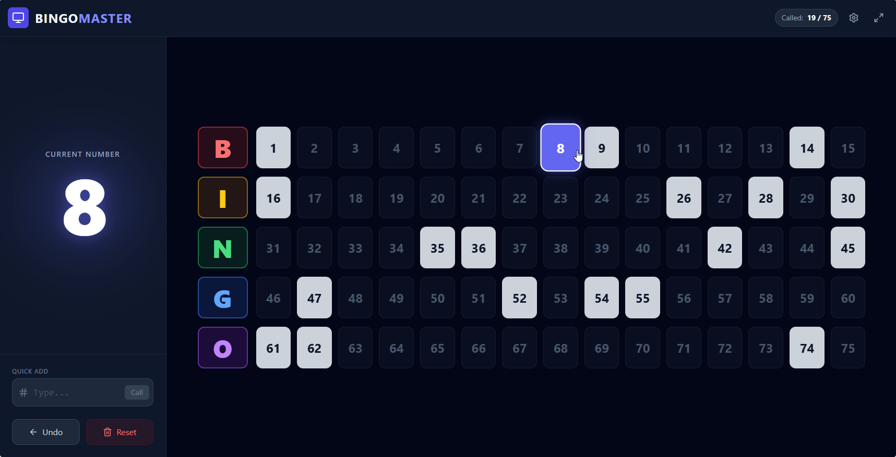

# 🎱 Bingo TV Dashboard

## What is this?

Hey there! 👋 This is a simple, fun Bingo Dashboard designed to be displayed on a big TV screen. It shows the current number that's been picked, along with a history of all the previous numbers. Perfect for your next bingo night!



## How it was made

This app was whipped up with the help of **Gemini 3 Pro**. It's a cool little experiment in AI-assisted coding. 🤖✨

## Free to Use!

This project is **free for everybody** to use. Go ahead, fork it, change it, use it for your local charity bingo, whatever you like!

### The "Fine Print" (Disclaimer)

Just a heads up: This comes with **no warranties or support**. It's provided "as is." If it breaks during the final round of bingo, we can't help you fix it (but we hope it doesn't!).

## License

This project is open source and available under the [MIT License](https://opensource.org/licenses/MIT).

---

## 🚀 How to Run It

Want to get this running on your machine? It's super easy.

### 1. Install Dependencies

First, open your terminal and install the necessary packages:

```bash
npm install
```

### 2. Run in Development Mode

To start the app and play around with it:

```bash
npm run dev
```

### 3. Build for Production

If you want to build the app for a real event (production):

```bash
npm run build
```

And to preview that build:

```bash
npm run preview
```

Enjoy your Bingo game! 🍀
